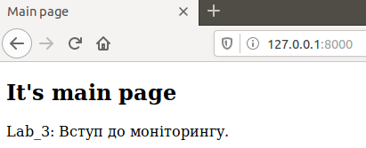
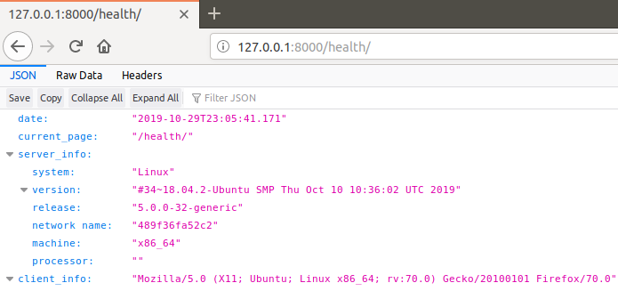

Lab_4: Робота з Docker
-

1. Ознайомлююся з документацією Docker.
2. Для перевірки чи докер встановлений і працює правильно на віртуальній машині запускаю перевірку версії, виведення допомоги та тестовий імедж.: 
    ```bash
    docker -v 
    docker -h
    docker run docker/whalesay cowsay Docker is fun 
   ```
    Результати виконання команд перенаправляю у файл `my_work.log` та комічу його до репозиторію.

3. Як можна бачити Docker працює з Імеджами та Контейнерами. Ознайомлююся з документацією Dockerfile, який описує контент імеджу.
4. Для знайомства з Docker створюю імедж із Django сайтом зробленим у попередній робот:
    - Оскільки проект на Python, то і базовий імедж також потрібно вибрати відповідний. Всі імеджі можна знайти на Python Docker Hub. Використавую команди, щоб завантажити базовий імедж з репозиторію:
    ```bush
    docker pull python:3.7-slim
    docker images
    docker inspect python:3.7-slim
    ```
    - Створюю файл з іменем Dockerfile та скопіюю туди вміс такого ж файлу з репозиторію devops_course;
    - Ознайомлююся із коментарями, щоб зрозуміти структуру написання Dockerfile;
    - Замінюю посилання на власний Git репозиторій із моїм веб-сайтом та комічу даний Dockerfile.
5. Створюю власний репозиторій на Docker Hub. Для цього заходжу у власний аккаунт на Docker Hub, після чого переходжу у вкладку `Repositories` і далі натискаю кнопку `Create new repository`. Даю назву репозиторію `lab4_devops`.
6. Виконую білд (build) Docker імеджа та завантажую його до репозиторію. Для цього вказую правильну назву репозиторію та TAG. Оскільки мій репозиторій vetalvr/lab4_devops то команда буде виглядати:
    ```
    docker build -t vetalvr/lab4_devops:django -f Dockerfile.site .
    docker images
    docker push vetalvr/lab4_devops:django
    ``` 
    - [Посилання на Docker Hub репозиторій](https://cloud.docker.com/repository/docker/vetalvr/lab4_devops);
    - Посилання на скачування імеджа: `vetalvr/lab4_devops:django`.
7. Для запуску веб-сайту виконую команду:
    ```
    docker run -it --name=django --rm -p 8000:8000 vetalvr/lab4_devops:django
    ```
    - Переходжу на адресу `http://127.0.0.1:8000` та бачу, що веб-сайт працює:
    
    
    
8. Оскільки веб-сайт готовий і працює, то створюю ще один контейнер із програмою моніторингу веб-сайту:
    - створіть ще один Dockerfile, у якому поміщаю програму моніторингу (використовую ключ `--file`);
    - виконую білд імеджа та даю йому тег `monitoring`;
    - запускаю два контейнери одночасно (у різних вкладках) та бачу, що програма моніторингу успішно доступається до сторінок Вашого веб-сайту (використовую ключ `--net=host`);
    - комічу `Dockerfile.monitor` та результати роботи програми моніторингу, запущеної з Docker контейнера - файл `server.log`.