Lab_5: Автоматизація за допомогою Makefile VS Docker Compose
======

Makefile
---
1. Створюю папку `my_app`, в якій буде знаходитись проект. Створюю папку `tests` де будуть тести на перевірку працездатності проекту. Копіюю файли з репозиторію `devops_course` у відповідні папки мого репозиторію. Ознайомлююся із вмістом кожного з файлів. Переглядаю файл `requirements.txt` у папці проекту та тестах. Це файл містить залежності додатку, які необхідно встановити. 

2. Перевіряю чи проект є працездатним, перейшовши у папку та після ініціалізації середовища виконую наступні команди:
    ```
    pipenv --python 3.7
    pipenv install -r requirements.txt
    pipenv run python app.py
    ```
   - Для виправлення помилки `redis.exceptions.ConnectionError`, що виникла при спробі запустити додатку, встановлюю `redis-server`, виконавши команду `sudo apt install redis-server`. Роблю зміни у конфігураційному файлі `/etc/redis/redis.conf`. Пропипую у файлі `/etc/hosts` перенаправлення запитів redis на локальну адресу `127.0.0.1 redis`;
   - Переконуюся, що головна сторінка працює:
   
    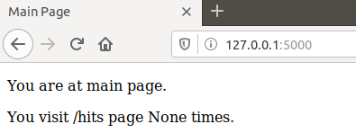
   
   - Ініціалузовую середовище для тестів у іншій вкладці терміналу та запускаю їх командою:
   ```
   pipenv run pytest test_app.py --url http://localhost:5000
   ```
   
   - Для того, щоб тести працювали створюю папку `logs` і лог-файл `app.log` у папці з додатком. Після цього тести проходять успішно:
   
   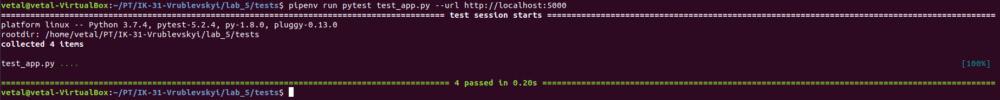
   
   - Видаляю всі файли, що створились в процесі запуску (Pipfile, Pipfile.lock);
    
   - Перевіряю роботу сайту, перейшовши на кожну із сторінок:
   
   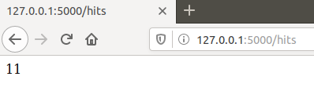
   
   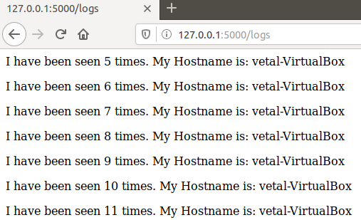
   
3. Створюю два Dockerfile з іменами як у репозиторі `devops_course` та Makefile, який допоможе автоматизувати процес розгортання.

4. Ознайомлююся із вмістом Dockerfile та Makefile та його директивами:
    - `STATES` і `REPO` - змінні які містять назви тегів та назву Docker Hub репозиторію відповідно;
    - `.PHONY` - утиліта `make`, яка вказує файлу, що переліченні нище цілі не являються файлами;
    - `$(STATES)` - ціль, призначення для білду контейнера;
    - `run` - ціль, призначення для створення мережі, у якій буде працювати додаток; запуску додатку і сховища `redis`;
    - `test-app` - ціль для запуску тестів;
    - `docker-prune` - ціль для очистки ресурсів, що бути використанні при роботі `Docker`.
    
5. Створюю Docker імеджі для додатку та для тестів виконавши команду:
    ```
    make .PHONY
    ```
6. Запускаю додаток та, відкривши новий термінал, запускаю тести:
    ```
    make run
    make test-app
    ```
    - Переконуюся, що тести пройшли успішно:
    
    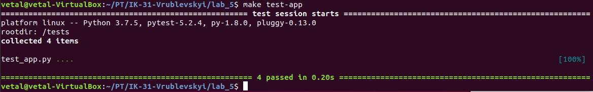
    - Перевіряю роботу кожної сторінки веб-сайту:
    
    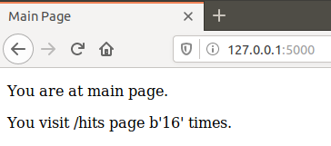
    
    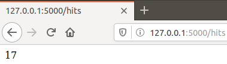
    
    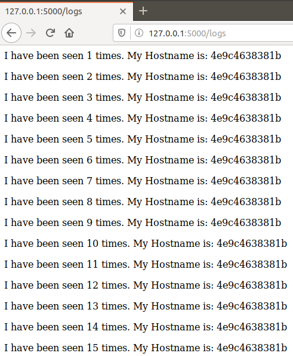
    
7. Зупиняю проект, натиснувши `Ctrl+C`, та очищаю всі ресурси Docker за допомогою команди:
    ```
    make docker-prune
    ```

8. Створюю директиву в `Makefile` для завантаження створених імеджів у Docker Hub репозиторій. Завантажую імеджі до репозиторію `vetalvr/lab5_devops` командою:
    ```
    make push
    ```
   - [Посилання на Docker Hub репозиторій](https://cloud.docker.com/repository/docker/vetalvr/lab5_devops);
9. Видаляю створені та завантаженні імеджі. Створюю директиву `delete-images` в `Makefile`, яка автоматизує процес видалення імеджів. Команда `docker images` виводить наступне:
    
    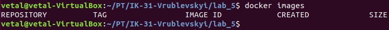

Docker-compose
---

1. Створюю файл `docker-compose.yaml` у кореновій папці проекту та заповнюю вмістом згідно прикладу. Проект за цим варіантом трохи відрізняється від першого тим, що у нього з'являється дві мережі: `secret` і `public`:
    - У мережі `secret` знаходяться `app` і `redis`. Отстанній не має доступу до зовнішніх ресурсів;
    - До мережі `public` відносяться `app` і `tests`. Таким чином `tests` i `redis` не мають доступу один до одного.

2. Перевіряю чи Docker-compose встановлений та працює у моїй системі, а далі просто запускаю `docker-compose`:
    ```
    docker-compose version
    docker-compose -p lab5 up
    ```
3. Перевіряю чи працює веб-сайт. Для цього переходжу за адресою `http:/127.0.0.1/`:

    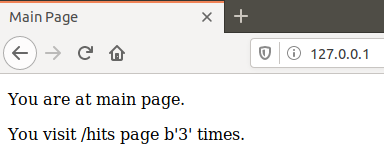
    
    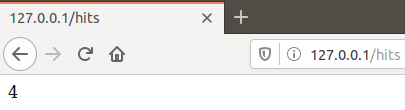
    
    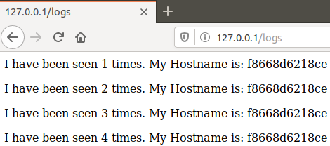
    
4. Перевіряю чи компоуз створив докер імеджі . Імеджі мають `compose-tests` і `compose-app`. Змінюю їх на власний репозиторій `vetalvr/lab5_devops` і перезапускаю `docker-compose`, очистивше імеджі без тегів за допомогою директиви в `Makefile`:
    
    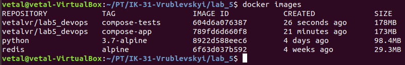
    
5. Зупиняю проект, натиснувши `Ctrl+C`, і очищаю ресурси створені компоуз `docker-compose down`.

6. Завантажую створені імеджі до `Docker Hub` репозиторію за допомого команди:
    ```
    docker-compose push
    ```

Завдання
---
1. На мою думку, як `docker-compose.yaml`, так і `Makefile` мають свої сфери використання і цільових користувачів:
    - `Makefiles` є інструментом збирання, принцип якого простий: для побудови цілі необхідно вказати залежності та команди для її побудови. Однак він має дещо важчу реалізацію і при роботі з багатьма `docker` контейнерами можуть виникнути складнощі;
    - За допомогою `docker-compose`  можна визначити багатоконтейнерну структуру в одному файлі, потім працювати з своєю програмою виконуючи лише одну команду, яка робить усе необхідне для її запуску, зупинки і деплою.

2. Створюю `docker-compose.yaml` для лабораторної №4:

    - `docker-compose.yaml` створює два імеджі для Django сайту та моніторингу ([docker-compose.yaml](https://github.com/Vetal-V/IK-31-Vrublevskyi/blob/master/lab_4/docker-compose.yaml) файл знаходиться тут);
    
    - Запускаю `docker-compose.yaml` командою
        ```
        docker-compose -p lab4 up
        ```
    - Перевіряю доступність головної сторінки та вкладки `health`:
    
    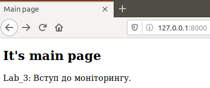
    
    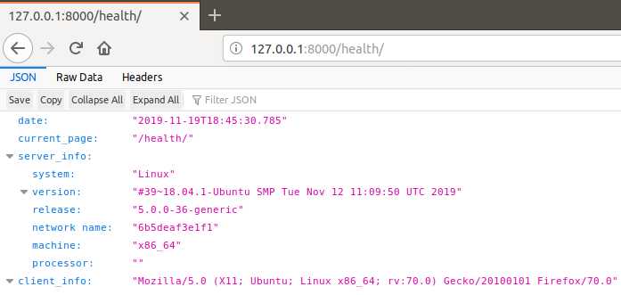
    
    - Зупиняю проект, натиснувши `Ctrl+C`, і очищаю ресурси створені компоуз `docker-compose down`. Витягую файл `server.log` з `volume`;
    
    - Завантажую створені імеджі до `Docker Hub` репозиторію за допомого команди ([Посилання на Docker Hub репозиторій](https://cloud.docker.com/repository/docker/vetalvr/lab4_devops)):
         ```
         docker-compose push
         ```
    